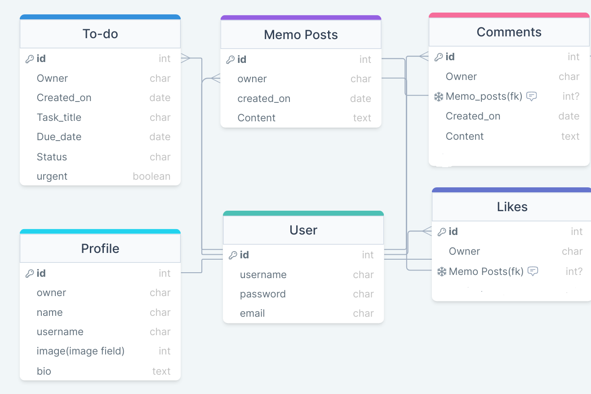
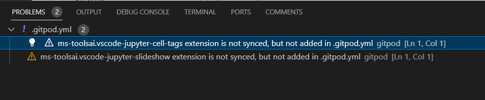
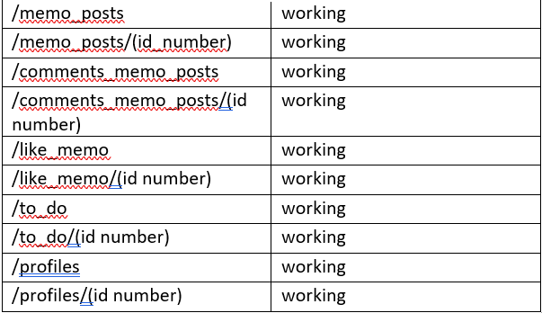
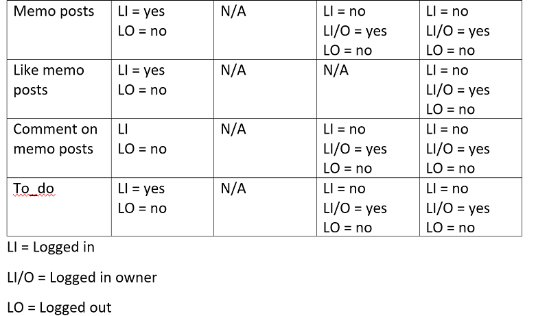

## CIRCLE OF TRUST (backend)
---

### Circle of trust is a website, inspired by the movie "Meet the Fockers", for use by the trusted circle of people: family, friends, co-workers etc. It's an app, where you have followers (your trusted circle),and it contains a memo page (where you can share your thoughts, suggestions etc) and to do list. Instead of stickers, pinned to the fridge/whiteboard, or groupchats in whatsapp, you can use this app. 
### This repository is the backend of the application using the Django REST Framework(DRF) holding the API database for the front end of the application.

## Datamodel sheme for the app

Custom models are: Profiles, memo posts, like memo, comments memo, to do list and followers.

### Frameworks and libraries

- DrawSQL
    
- Django Cloudinary Storage 
    
- Pillow 
    
- Git
    
- Github
    
- Gitpod
    
- Heroku
    
- Django Rest Auth

- PostgreSQL

- Cors headers

### Bugs

- After deploying to Heroku while opening the app I got BadRequest 400 Error. It was fixed by deleting "https://" from value of ALLOWED_HOST config var key. 
- The function of login/logout wasn't working. With the hekp of slack it was fixed by installing the library dj-rest-auth 2.1.9 version. If the version of this library is not updated, I was getting an error 401 (User is not authorized).

### Testing

- PEP8 Online Validator was tested in the Gitpod workspace.

- Manual testing

Manual Tests were carried out for the Url paths, search and filter functionality, and CRUD functionality, all were made into tables and checked off.

- Search and Filter was manually tested as well and everything is working as it should. 

- CRUD Testing
Table was made to check a user could Create, Read, Update and/or Delete items.
LI meaning the user was logged in, and so could Create, and read.
LO meaning the user was not logged in and so could only read.
LI/O meaning the user was logged in and the owner so had full CRUD functionality.

## Deployment

The Circle of trust API is deployed to Heroku, using an ElephantSQL Postgres database.
To duplicate deployment to Heroku, follow these steps:

- You need a Cloudinary account to host user profile images.
- Login to Cloudinary.
- Select the 'dashboard' option.
- Copy the value of the 'API Environment variable' from the part starting `cloudinary://` to the end. 
- Log in to Heroku.
- Select 'Create new app' from the 'New' menu at the top right.
- Enter a name for the app and select the appropriate region.
- Select 'Settings' from the menu at the top.
- Login to ElephantSQL.
- Click 'Create new instance' on the dashboard.
- Name the 'plan' and select the 'Tiny Turtle (free)' plan.
- Select 'region' and choose the nearest data centre to your location.
- Click 'Review'.
- Go to the ElephantSQL dashboard and click on the 'database instance name' for this project.
- Copy the ElephantSQL database URL to your clipboard (this starts with `postgres://`).
- Return to the Heroku dashboard.
- Select the 'settings' tab.
- Locate the 'reveal config vars' link and select.
- Enter the following config var names and values:
    - `CLOUDINARY_URL`: *your cloudinary URL as obtained above*
    - `DATABASE_URL`: *your ElephantSQL postgres database URL as obtained above*
    - `SECRET_KEY`: *your secret key*
    - `ALLOWED_HOST`: *the url of your Heroku app (but without the `https://` prefix)*
- Select the 'Deploy' tab at the top.
- Select 'GitHub' and confirm you wish to deploy using GitHub. You may be asked to enter your GitHub password.
- Find the 'Connect to GitHub' section and use the search box to locate your repo.
- Select 'Connect' when found.
- Optionally choose the main branch under 'Automatic Deploys' and select 'Enable Automatic Deploys' if you wish your deployed API to be automatically redeployed every time you push changes to GitHub.
- Find the 'Manual Deploy' section, choose 'main' as the branch to deploy and select 'Deploy Branch'.
- Your API will shortly be deployed and you will be given a link to the deployed site when the process is complete.

### Credits

- The DRF API Walktrough project
- Moments walktrough project
- Image for the app was taken from the google images
- Slack community
- Tutor support

